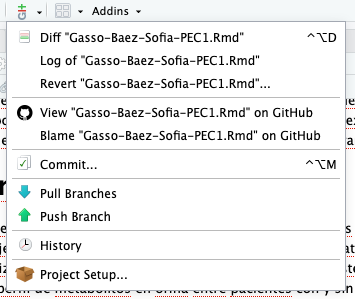

# Tabla de Contenidos

1.  *Abstract*

2.  Objetivos

3.  Métodos

4.  Resultados

5.  Discusión

6.  Conclusiones

7.  Referencias

8.  Bibliografía consultada

# Abstract

Este informe presenta el análisis exploratorio de un *dataset* de metabolómica relacionado con la caquexia humana. Se ha utilizado Bioconductor en R para la carga, preprocesamiento y exploración de los datos. Se creó un objeto de clase *SummarizedExperiment*, facilitando la gestión de los datos y metadatos. Este objeto se ha comparado con *ExpressionSet*, del cual se extiende. A través del Análisis de Componentes Principales (PCA), se han identificado patrones biológicos relevantes entre los pacientes con y sin caquexia.

# Objetivos

Los objetivos que se desean alcanzar en este trabajo de análisis y exploración de datos con herramientas de Bioconductor son los siguientes:

-   Seleccionar y descargar un dataset de metabolómica (human_cachexia).

-   Crear un objeto de clase *SummarizedExperiment* con datos y metadatos.

-   Realizar un análisis exploratorio de los datos.

-   Interpretar los resultados desde el punto de vista biológico.

-   Documentar y compartir el trabajo en un repositorio de GitHub.

# Métodos

### Selección del Dataset

Para realizar esta exploración multivariante de los datos se ha seleccionado el dataset **human_cachexia.csv**, del repositorio de GitHub proporcionado en la asignatura para realizar este estudio. Este recoge diferentes analitos presentes en muestras de orina de 2 grupos de pacientes: pacientes que sufren de caquexia (pérdida extrema de peso corporal sin buscarlo) y el grupo control (no sufren de caquexia).

Su estructura se puede observar en la siguiente tabla:

```{r, DataSet, message = FALSE, warning = FALSE}
#Se carga la librería
library(readr)

# Se cargan los datos y se guardan en la variable human_cachexia
human_cachexia <- read.csv("/Users/sofiagassobaez/Desktop/MasterBioinformatica/3r_semestre/Analisis de datos omicos/PEC1/human_cachexia.csv", header = TRUE, sep = ",")
head(human_cachexia[, 1:3], 3) # Se muestran las 3 primeras filas y columnas
```

Las variables que contiene este dataset son el identificador del paciente, el grupo al que pertenece en lo referente a la pérdida de músculo (caquexia o control) y la concentración en orina de 63 metabolitos distintos. Se tratan de tipo caracter las dos primeras columnas (Patient ID y Muscle loss), mientras que el resto son *doubles* (números decimales).

## Preprocesamiento de los datos y creación del objeto

Para cumplir con uno de los objetivos de este trabajo, que es crear un objeto de clase SummarizedExperiment, primero hay que tratar un poco los datos. Se van a pasar los Patient ID a los nombres de las filas en lugar de ser una columna más del dataset, y luego se elimina la columna. Esto facilitará el posterior análisis de los datos. Después se extraen los metadatos de la columna que contiene información sobre el tipo de paciente (con caquexia o control) y se guardan en una variable, haciendo posible borrar dicha columna también del dataset.

Finalmente, se puede crear el objeto de clase SummarizedExperiment, llamado cachexia_SE, que va a contener toda la información del dataset pero organizada de una forma más eficiente para poder trabajar con ella.

```{r message = FALSE, warning = FALSE}
library(SummarizedExperiment)
library(dplyr)

# Se asignan identificadores de filas
rownames(human_cachexia) <- human_cachexia[, 1] # Asigna los Patient IDs a
human_cachexia <- human_cachexia[, -1]  # Elimina la columna de identificadores

# Se extraen metadatos de la columna que contiene la condición de caquexia o no
metadatos <- data.frame(Condition = factor(human_cachexia$Muscle.loss))
rownames(metadatos) <- rownames(human_cachexia)

# Se elimina la columna 'Muscle.loss' de los datos principales (ya está guardado en metadatos)
human_cachexia <- human_cachexia[, -which(colnames(human_cachexia) == "Muscle.loss")]

# Se verifican las dimensiones de los dataset antes de crear un objeto de clase SummarizedExperiment
print(dim(human_cachexia))
print(dim(metadatos)) 

# Se transpone la matriz human_cachexia para que los datos de los metabolitos estén en las filas
human_cachexia <- t(human_cachexia)

# Se crea el objeto SummarizedExperiment llamado cachexia_SE
counts_matrix <- as.matrix(human_cachexia)
mode(counts_matrix) <- "numeric"  # Asegura que todos los valores sean numéricos

cachexia_SE <- SummarizedExperiment(
  assays = list(counts = as.matrix(human_cachexia)),
  colData = metadatos
)

# Se verifica el objeto creado y se guarda en formato binario (.Rda) para poder subirlo a GitHub
print(cachexia_SE)
save(cachexia_SE, file = "cachexia_SE.Rda")
```

Como se comenta en el enunciado de esta PEC, la clase *SummarizedExperiment* es una extensión de *ExpressionSet*. La estructura en la que los datos están almacenados en un objeto de clase *ExpressionSet* es ligeramente distinta a la de *SummarizedExperiment*, aunque el objetivo de ambas sea el mismo: almcenar los datos ómicos de un dataset de manera que se facilite el estudio y análisis de estos, así como sus metadatos.

Aunque sean muy parecidas, existe una diferencia principal entre ambas, y es que *SummarizedExperiment* es mucho más flexible en lo que respecta a la información de las filas. De esta forma se pueden enfocar muy adecuadamente datos de experimentos basados en secuenciación (como RNA-seq).

Con los datos bien organizados y listos para ser analizados, se puede realizar un análisis exploratorio para poder comprender cómo se comporta la enfermedad a nivel de metabolitos en orina, si existen diferencias significativas o no entre grupos control y caquexia, y poder encontrar biomarcadores de esta enfermedad (si es que los hubiese).

Para poder realizar esta exploración, se ha seleccionado como método el Análisis de Componentes Principales (PCA), ya que nos va a permitir visualizar la variabilidad que hay en los datos de metabolitos en los pacientes con caquexia y los del grupo control. El PCA genera nuevas variables a partir de la combinación lineal de las variables originales del dataset, de manera que se reduce la dimensionalidad de los datos a la vez que se conserva la mayor cantidad de información posible (sobretodo la relacionada con la variabilidad).

Cada componente principal que se obtiene es una combinacion lineal de los metabolitos (en el caso de este análisis), el cual maximiza la varianza de los datos en la nueva dirección. Además son ortgonales entre sí en el espacio, lo cual significa que no están correlacionados. De este análisis se obtendrán dos componentes principales: PC1 (que es la dirección que explica la mayor parte de la variabilidad en los datos), y PC2 (explica la segunda mayor variabilidad). En este análisis se va a usar la función **pca()**, la cual realiza estos cálculos.

# Resultados

Se realiza el PCA de los datos de cachexia_SE con la función **pca()**, de la librería FactoMineR. Para poder llevar a cabo el análisis, primero se va a extraer la matriz de datos del objeto SummarizedExperiment y se pasan a formato DataFrame.

Una vez se comprueba que todos los datos que han quedado son numéricos, y que las dimensiones de los datos numéricos son correctas, se realiza el PCA de la matriz transpuesta (de esta manera, quedan los datos (muestras) de los metabolitos en las filas, y en las columnas están los pacientes (variables)). Esto nos va a devolver el Análisis de Componentes Principales completo para este conjunto de datos, donde se va a obtener qué componentes son los que explican la mayor variabilidad en los datos. También va a ayudar a ver si existen diferencias significativas entre el grupo controly el grupo de pacientes caquéxicos.

Finalmente se grafican los resultados para visualizar los datos obtenidos del PCA y poder evaluar si los grupos control y pacientes caquéxicos muestran diferencias estando separados entre sí o no.

A continuación se muestra el código empleado para realizar este análisis.

```{r, Análisis exploratorio, message = FALSE, warning = FALSE}
# Se cargan las librerías
library(FactoMineR)
library(factoextra)
library(pheatmap)
library(ggplot2)

# Se extrae la matriz de datos del objeto SummarizedExperiment y se pasa a dataframe
cachexia_matriz <- assay(cachexia_SE)
cachexia_datos <- as.data.frame(cachexia_matriz)

# Se verifica que todas las columnas sean numéricas
cachexia_datos_numericos <- cachexia_datos[, sapply(cachexia_datos, is.numeric)]
print(head(cachexia_datos_numericos[, 1:3], 3)) # Se visualiza para comprobar

# Se verifican las dimensiones antess de realizar el PCA
print(dim(t(cachexia_datos_numericos)))  # Las filas deben coincidir con length(colData(cachexia_SE)$Condition)
print(length(colData(cachexia_SE)$Condition))

# Se realiza el PCA
pca_result <- PCA(t(cachexia_datos_numericos), graph = FALSE) # Se transponen los datos para asegurar su correcta estructuración

# Se muestran en un gráfico los 10 metabolitos con mayor peso en la separación de ambos grupos control y caquexia
fviz_pca_var(pca_result, repel = "TRUE", col.var = "contrib", 
             select.var = list(contrib = 10)) + 
  labs(title = "Contribución 10 principales metabolitos al PCA")


# Se construye el gráfico del PCA
fviz_pca_ind(
  pca_result, 
  habillage = colData(cachexia_SE)$Condition, 
  title = "Análisis PCA de los pacientes con caquexia y control",
  axes = c(1, 2), # Para asegurarse de que usa PC1 y PC2
  label = "none"
) + 
  labs(x = paste0("PC1 (", round(pca_result$eig[1,2], 1), "%)"),
       y = paste0("PC2 (", round(pca_result$eig[2,2], 1), "%)"))
```

Como se puede observar en el gráfico *Contribución 10 principales metabolitos al PCA*, los 3 metabolitos en orina que más peso tienen en la separación de los grupos (es decir, donde se encuentra la mayor variabilidad entre ambos grupos, son la Creatinina, Glutamina y Serina. Estos 3 metabolitos son los que más contribuyen a la varianza de los componentes principales, y por ende, los que tienen mayor impacto en la variabilidad que está explicada por PC1 y PC2.

Del gráfico *Análisis PCA de los pacientes con caquexia y control* se pueden extraer otro tipo de conclusiones muy relevantes para este análisis exploratorio. Se pueden observar en los 2 ejes los componentes principales PC1 y PC2. PC1 explica el **40'4%** de la variabilidad en los datos, mientras que PC2 explica el **8'2%**, cubriendo un total de casi el 50% de la variabilidad en los datos explicada entre ambos componentes. En este gráfico se representan las proyecciones de los pacientes con caquexia y los pacientes control en el espacio de los dos primeros componentes principales del análisis. Cada punto es un paciente, y los ejes representan PC1 y PC2 (combinaciones de los metabolitos que explican la mayor parte de los datos). Finalmente, los colores indican el grupo al que pertenece el paciente (caquexia o control).

En este gráfico, los puntos que están más cercanos entre sí tienen perfiles metabólicos muy similares, mientras que como más alejados están entre sí, más distinto es su perfil de metabolitos. En este caso, vemos cómo se distribuyen a lo largo del eje de PC1 (lo cual es lógico debido a que PC1 representa el 40% de la variabilidad). Como se puede observar, existe cierta agrupación del grupo de pacientes control a la izquierda del gráfico, y cierta agrupación del grupo de pacientes con caquexia hacia la derecha del gráfico, mostrando una separación entre ellos a lo largo del ejePC1. Esta separación sugiere que realmente hay diferencias entre los perfiles de metabolitos de ambos grupos. Existe algún punto muy alejado del conjunto, lo cual puede indicar que ese individuo tiene un perfil de metabolitos muy diferente al resto.

En resumen, con estos gráficos resultado del análisis exploratorio se pueden saber cuales son los metabolitos que más impacto tienen en la variabilidad entre los grupos, y cómo se distribuyen los perfiles de metabolitos de los pacientes, observando cierta separación entre ambos grupos (control y caquexia), lo cual sugiere que sí pueden encontrarse diferencias en los metabolitos en orina, y por tanto, se pueden potencialmente establecer biomarcadores para esta enfermedad.

# Discusión

El uso de SummarizedExperiment ha sido clave en este análisis para poder organizar los datos de una forma estructurada. Este facilita la gestión de los metadatos y todos los datos asociados al experimento. Es ventajoso usar esta clase para objetos que almacenen datos de experimentos porque permite un acceso eficiente a estos, a parte de a los metadatos, y facilita mucho los análisis que se quieran hacer sobre este conjunto de datos.

Por otra parte, este estudio puede presentar algunas limitaciones referentes al dataset, como por ejemplo, que el tamaño poblacional del dataset no sea lo suficientemente grande para sacar estadísticas concluyentes, o que haya habido un sesgo a la hora de seleccionar los pacientes. Todo esto debería ser revisado y mejorado para futuros estudios.

Finalmente, el Análisis de Componentes Principales ha mostrado que existen diferencias significativas en el perfil de metabolitos en orina entre el grupo de pacientes control y con caquexia. En el gráfico se ha podido observar cómo hay una separación en la agrupación de ambos grupos, lo cual tiene potencial para ser aplicado en el diagnóstico y tratamiento de la caquexia. Con más estudios que perfilen los metabolitos en orina más frecuentes en pacientes con caquexia, se puede refinar mucho más la búsqueda de síntomas y ayudar a una detección más temprana de esta enfermedad.

# Conclusiones

En este informe se ha logrado analizar un conjunto de datos de metabolómica en Bioconductor, creando un objeto de clase SummarizedExperiment a partir de un dataset. Con ello, se ha facilitado la organización y el análisis de los datos. Los resultados de este análisis sugieren que existen diferencias en el perfil de metabolitos en orina entre pacientes con y sin caquexia, demostrando la potencia de las herramientas bioinformáticas en el ámbito de la salud.

# Referencias

Enlace al repositorio de GitHub: <https://github.com/SofiaGasso/Gasso-Baez-Sofia-PEC1>

Control de versiones con GitHub desde RStudio:



# Bibliografía consultada

-   Apuntes de la asignatura

-   *Pagès, M. M. V. o. J. H. H. (s. f.). SummarizedExperiment for Coordinating Experimental Assays, Samples, and Regions of Interest.* <https://bioconductor.org/packages/release/bioc/vignettes/SummarizedExperiment/inst/doc/SummarizedExperiment.html>

-   *RPUBS - Principal Component Analysis (PCA). (s. f.).* <https://rpubs.com/KarolinaSzczesna/862710>
